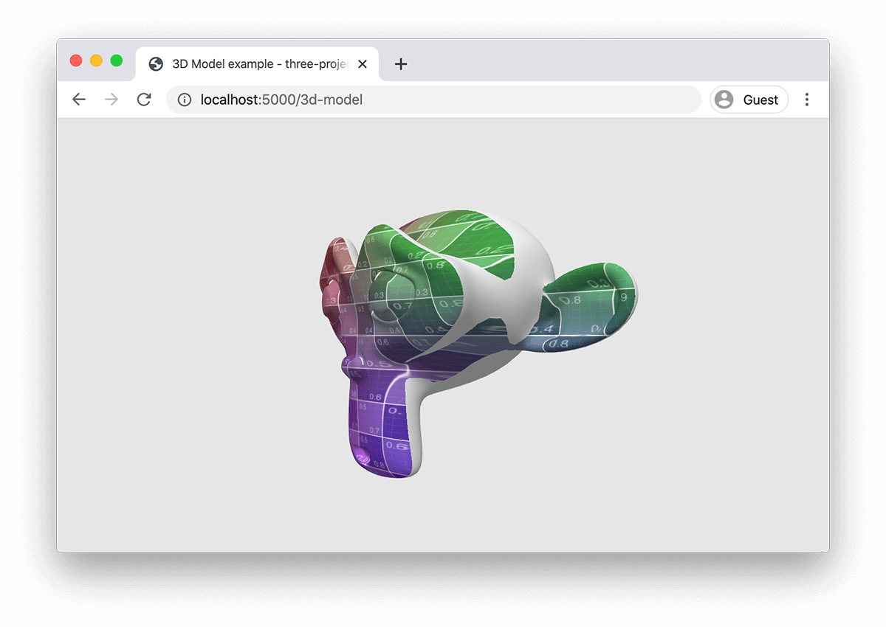

# three-projected-material

> Three.js Material which lets you do [Texture Projection]() on a 3d Model.

[](https://marcofugaro.github.io/three-projected-material)

### [EXAMPLES](https://marcofugaro.github.io/three-projected-material)

## Installation

After having installed Three.js, install it from npm with:

```
npm install three-projected-material
```

or

```
yarn add three-projected-material
```

You can also use it from the CDN, just make sure to put this after the Three.js script:

```html
<script src="https://unpkg.com/three-projected-material"></script>
```

## Getting started

You can import it like this

```js
import ProjectedMaterial, { project } from 'three-projected-material'
```

or, if you're using CommonJS

```js
const { default: ProjectedMaterial, project } = require('three-projected-material')
```

Instead, if you install it from the CDN, its exposed under `window.projectedMaterial`, and you use it like this

```js
const { default: ProjectedMaterial, project } = window.projectedMaterial
```

Then, you can use it like this:

```js
const geometry = new THREE.BoxGeometry(1, 1, 1)
const material = new ProjectedMaterial({
  camera, // the camera that acts as a projector
  texture, // the texture being projected
  color: '#cccccc', // the color of the object if it's not projected on
  textureScale: 0.8, // scale down the texture a bit
  cover: true, // enable background-size: cover behaviour, by default it's like background-size: contain
})
const box = new THREE.Mesh(geometry, material)
webgl.scene.add(box)

// move the mesh any way you want!
box.rotation.y = -Math.PI / 4

// and when you're ready project the texture!
project(box)
```

ProjectedMaterial also supports instanced objects via Three.js' [InstancedMesh](https://threejs.org/docs/index.html#api/en/objects/InstancedMesh), this is an example usage:

```js
const NUM_ELEMENTS = 1000
const dummy = new THREE.Object3D()

const geometry = new THREE.BoxBufferGeometry(1, 1, 1)
const material = new ProjectedMaterial({
  camera,
  texture,
  color: '#cccccc',
  instanced: true,
})

// allocate the projection data
allocateProjectionData(geometry, NUM_ELEMENTS)

// create the instanced mesh
const instancedMesh = new THREE.InstancedMesh(geometry, material, NUM_ELEMENTS)

for (let i = 0; i < NUM_ELEMENTS; i++) {
  // position the element
  dummy.position.x = random(-width / 2, width / 2)
  dummy.position.y = random(-height / 2, height / 2)
  dummy.rotation.x = random(0, Math.PI * 2)
  dummy.rotation.y = random(0, Math.PI * 2)
  dummy.rotation.z = random(0, Math.PI * 2)
  dummy.updateMatrix()
  instancedMesh.setMatrixAt(i, dummy.matrix)

  // project the texture!
  dummy.updateMatrixWorld()
  projectInstanceAt(i, instancedMesh, dummy.matrixWorld)
}

webgl.scene.add(instancedMesh)
```

If you want to see the remaining code, and other usages, check out the [examples]().

## API

### new ProjectedMaterial({ camera, texture, ...others })

Create a new material to later use for a mesh.

| Option         | Default     | Description                                                                                                                                                                                                                                                                |
| -------------- | ----------- | -------------------------------------------------------------------------------------------------------------------------------------------------------------------------------------------------------------------------------------------------------------------------- |
| `camera`       |             | The [PerspectiveCamera](https://threejs.org/docs/#api/en/cameras/PerspectiveCamera) the texture will be projected from.                                                                                                                                                    |
| `texture`      |             | The [Texture](https://threejs.org/docs/#api/en/textures/Texture) being projected.                                                                                                                                                                                          |
| `color`        | `'#ffffff'` | The color the non-projected on parts of the object will have.                                                                                                                                                                                                              |
| `textureScale` | 1           | Make the texture bigger or smaller.                                                                                                                                                                                                                                        |
| `cover`        | false       | Wheter the texture should act like [`background-size: cover`](https://css-tricks.com/almanac/properties/b/background-size/) on the projector frustum. By default it works like [`background-size: contain`](https://css-tricks.com/almanac/properties/b/background-size/). |
| `instanced`    | false       | Wether the material will be part of an [InstancedMesh](https://threejs.org/docs/#api/en/objects/InstancedMesh). If this is true, [`allocateProjectionData()`]() and [`projectInstanceAt()`]() must be used instead of [`project()`]().                                     |

### project(mesh)

Project the texture from the camera on the mesh.

| Option | Description                                          |
| ------ | ---------------------------------------------------- |
| `mesh` | The mesh that has a `ProjectedMaterial` as material. |

### allocateProjectionData(geometry, instancesCount)

Allocate the data that will be used when projecting on an [InstancedMesh](https://threejs.org/docs/#api/en/objects/InstancedMesh). Use this on the geometry that will be used in pair with a `ProjectedMaterial` when initializing `InstancedMesh`.

_**NOTE:** Don't forget to pass `instanced: true` to the projected material._

| Option           | Description                                                                   |
| ---------------- | ----------------------------------------------------------------------------- |
| `geometry`       | The geometry that will be passed to the `InstancedMesh`.                      |
| `instancesCount` | The number of instances, the same that will be passed to the `InstancedMesh`. |

### projectInstanceAt(index, instancedMesh, matrixWorld)

Do the projection for an [InstancedMesh](https://threejs.org/docs/#api/en/objects/InstancedMesh). Don't forget to call `updateMatrixWorld()` like you do before calling `InstancedMesh.setMatrixAt()`.

```js
dummy.updateMatrixWorld()
projectInstanceAt(i, instancedMesh, dummy.matrixWorld)
```

[Link to the full example]().

_**NOTE:** Don't forget to pass `instanced: true` to the projected material._

| Option          | Description                                                                                                                        |
| --------------- | ---------------------------------------------------------------------------------------------------------------------------------- |
| `index`         | The index of the instanced element to project.                                                                                     |
| `instancedMesh` | The [InstancedMesh](https://threejs.org/docs/#api/en/objects/InstancedMesh) with a projected material.                             |
| `matrixWorld`   | The `matrixWorld` of the dummy you used to position the instanced mesh element. Be sure to call `.updateMatrixWorld()` beforehand. |

## TODO

- handle opacity
- multiple projections onto an object
- different materials for the rest of the object
