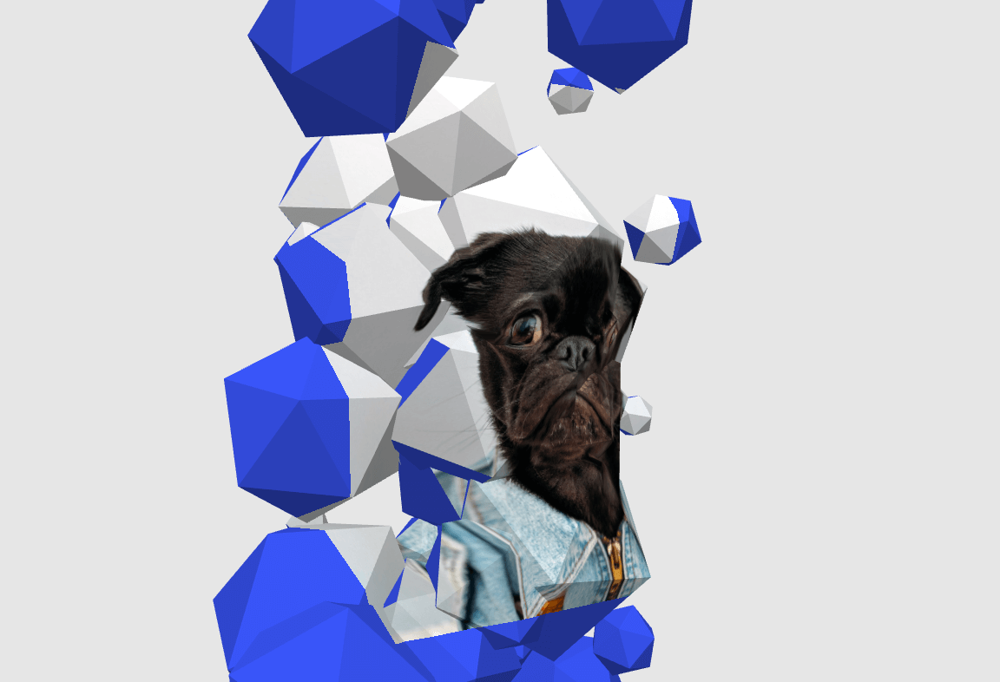
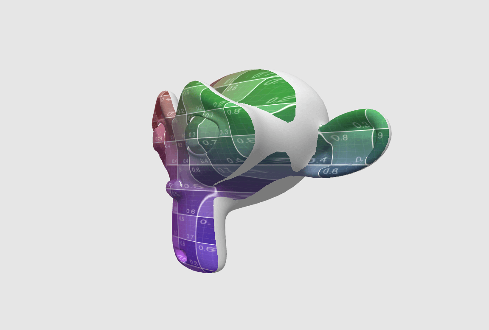
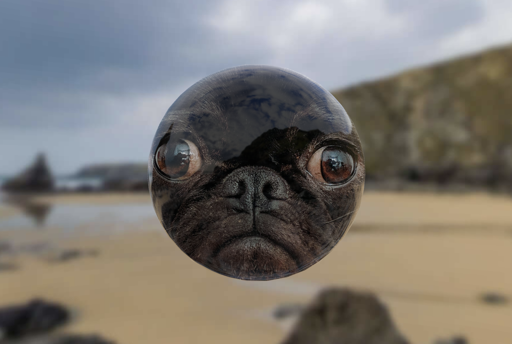
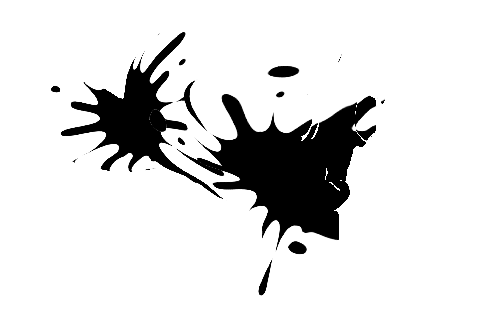
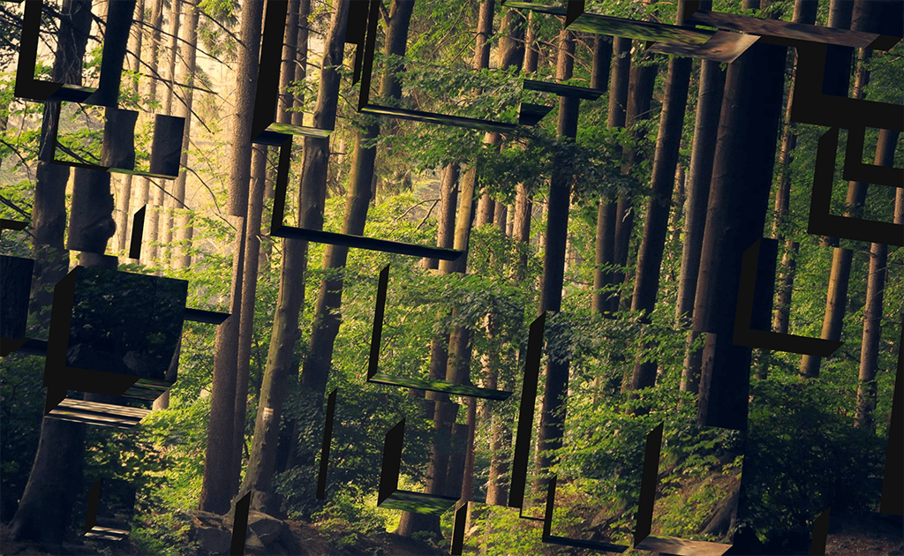

# three-projected-material

> Three.js Material which lets you do [Texture Projection](https://en.wikipedia.org/wiki/Projective_texture_mapping) on a 3d Model.

<p align="center">
  <a href="https://marcofugaro.github.io/three-projected-material/"></a>
</p>

## Recommended Installation

This method supports `TypeScript`.

If you're familiar with [Node.js](https://nodejs.org/) and managing dependencies
with `npm`, and have a build setup in place or know how to serve ES modules to a
browser, then install `three` and `three-projected-material` from NPM,

```
npm install three three-projected-material
```

then import `ProjectedMaterial` and you'll be on your way:

```js
import {ProjectedMaterial} from 'three-projected-material'

const mat = new ProjectedMaterial(/*...*/)
// ...
```

## Alternative Installation

These methods do not support `TypeScript`, only plain `JavaScript`.

If you don't have a build setup or you are only familiar with plain HTML files,
import `three-projected-material` from a
[CDN](https://www.cloudflare.com/learning/cdn/what-is-a-cdn/) such as
https://unpkg.com, like so:

```html
<script type="module">
	import {ProjectedMaterial} from 'https://unpkg.com/three-projected-material@^3.0.0'

	const mat = new ProjectedMaterial(/*...*/)
	// ...
</script>
```

If you're still loading libraries as global variables using old-school script
tags (f.e. you have a global `THREE` object), you can use the `.global.js` file,
although we recommend using ES Modules as per above. Make sure to put the global
script after the three.js script:

```html
<script src="..../three.js"></script>
<script src="https://unpkg.com/three-projected-material@^3.0.0/dist/ProjectedMaterial.global.js"></script>
<script>
	const {ProjectedMaterial} = window.projectedMaterial

	const mat = new ProjectedMaterial(/*...*/)
	// ...
</script>
```

## Usage

Use `ProjectedMaterial` like so:

```js
// ... get the ProjectedMaterial class as per above ...

const geometry = new THREE.BoxGeometry(1, 1, 1)
const material = new ProjectedMaterial({
	camera, // the camera that acts as a projector
	texture, // the texture being projected
	textureScale: 0.8, // scale down the texture a bit
	textureOffset: new THREE.Vector2(0.1, 0.1), // you can translate the texture if you want
	cover: true, // enable background-size: cover behaviour, by default it's like background-size: contain
	color: '#ccc', // the color of the object if it's not projected on
	roughness: 0.3, // you can pass any other option that belongs to MeshPhysicalMaterial
})
const box = new THREE.Mesh(geometry, material)
webgl.scene.add(box)

// move the mesh any way you want!
box.rotation.y = -Math.PI / 4

// and when you're ready project the texture on the box!
material.project(box)
```

`ProjectedMaterial` also supports **instanced meshes** via three.js' [InstancedMesh](https://threejs.org/docs/index.html#api/en/objects/InstancedMesh), and even **multiple projections**. Check out the examples below for a detailed guide!

## [Examples](https://marcofugaro.github.io/three-projected-material/)

<p align="center">
  <a href="https://marcofugaro.github.io/three-projected-material/basic"></a>
  <a href="https://marcofugaro.github.io/three-projected-material/same-camera"></a>
  <a href="https://marcofugaro.github.io/three-projected-material/3d-model"></a>
  <a href="https://marcofugaro.github.io/three-projected-material/orthographic-camera"></a>
  <a href="https://marcofugaro.github.io/three-projected-material/transparency"></a>
  <a href="https://marcofugaro.github.io/three-projected-material/envmap"></a>
  <a href="https://marcofugaro.github.io/three-projected-material/multiple-projections"></a>
  <a href="https://marcofugaro.github.io/three-projected-material/instancing"></a>
  <a href="https://marcofugaro.github.io/three-projected-material/multiple-projections-instancing"></a>
</p>

## API Reference

### `new ProjectedMaterial({ camera, texture, ...others })`

Create a new material to later use for a mesh.

| Option          | Default               | Description                                                                                                                                                                                                                                                                                                                                                                                     |
| --------------- | --------------------- | ----------------------------------------------------------------------------------------------------------------------------------------------------------------------------------------------------------------------------------------------------------------------------------------------------------------------------------------------------------------------------------------------- |
| `camera`        |                       | The [PerspectiveCamera](https://threejs.org/docs/#api/en/cameras/PerspectiveCamera) the texture will be projected from.                                                                                                                                                                                                                                                                         |
| `texture`       |                       | The [Texture](https://threejs.org/docs/#api/en/textures/Texture) being projected.                                                                                                                                                                                                                                                                                                               |
| `textureScale`  | 1                     | Make the texture bigger or smaller.                                                                                                                                                                                                                                                                                                                                                             |
| `textureOffset` | `new THREE.Vector2()` | Offset the texture in a x or y direction. The unit system goes from 0 to 1, from the bottom left corner to the top right corner of the projector camera frustum.                                                                                                                                                                                                                                |
| `cover`         | false                 | Wheter the texture should act like [`background-size: cover`](https://css-tricks.com/almanac/properties/b/background-size/) on the projector frustum. By default it works like [`background-size: contain`](https://css-tricks.com/almanac/properties/b/background-size/).                                                                                                                      |
| `...options`    |                       | Other options you pass to any three.js material like `color`, `opacity`, `envMap` and so on. The material is built from a [MeshPhysicalMaterial](https://threejs.org/docs/index.html#api/en/materials/MeshPhysicalMaterial), so you can pass any property of that material and of its parent [MeshStandardMaterial](https://threejs.org/docs/index.html#api/en/materials/MeshStandardMaterial). |

These properties are exposed as properties of the material, so you can change them later.

For example, to update the material texture and change its scale:

```js
material.texture = newTexture
material.textureScale = 0.8
```

### `material.project(mesh)`

Project the texture from the camera on the mesh. With this method we "take a snaphot" of the current mesh and camera position in space. The
After calling this method, you can move the mesh or the camera freely.

| Option | Description                                          |
| ------ | ---------------------------------------------------- |
| `mesh` | The mesh that has a `ProjectedMaterial` as material. |

### `allocateProjectionData(geometry, instancesCount)`

Allocate the data that will be used when projecting on an [InstancedMesh](https://threejs.org/docs/#api/en/objects/InstancedMesh). Use this on the geometry that will be used in pair with a `ProjectedMaterial` when initializing `InstancedMesh`.

This needs to be called before `.projectInstanceAt()`.

| Option           | Description                                                                   |
| ---------------- | ----------------------------------------------------------------------------- |
| `geometry`       | The geometry that will be passed to the `InstancedMesh`.                      |
| `instancesCount` | The number of instances, the same that will be passed to the `InstancedMesh`. |

### `material.projectInstanceAt(index, instancedMesh, matrix)`

Do the projection for an [InstancedMesh](https://threejs.org/docs/#api/en/objects/InstancedMesh). Don't forget to call `updateMatrix()` like you do before calling `InstancedMesh.setMatrixAt()`.

To do projection an an instanced mesh, the geometry needs to be prepared with `allocateProjectionData()` beforehand.

```js
dummy.updateMatrix()
projectInstanceAt(i, instancedMesh, dummy.matrix)
```

[Link to the full example about instancing](https://marcofugaro.github.io/three-projected-material/instancing).

| Option          | Description                                                                                                              |
| --------------- | ------------------------------------------------------------------------------------------------------------------------ |
| `index`         | The index of the instanced element to project.                                                                           |
| `instancedMesh` | The [InstancedMesh](https://threejs.org/docs/#api/en/objects/InstancedMesh) with a projected material.                   |
| `matrix`        | The `matrix` of the dummy you used to position the instanced mesh element. Be sure to call `.updateMatrix()` beforehand. |
